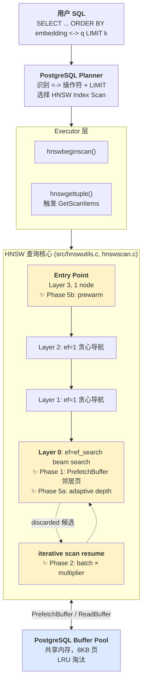

# pgvector HNSW 查询与构建优化

[](https://github.com/sin-of-lazy/pgvector-hnsw-hotcold/actions)
[](https://www.postgresql.org/)
[](https://github.com/pgvector/pgvector)
[](./LICENSE)

> **面向 AI Infra / RAG 在线检索场景的 PostgreSQL pgvector 向量索引优化项目**  
> 基于 pgvector 0.8.4，针对 HNSW 索引的查询路径、动态参数调优、构建期性能和并行扩展进行优化与验证。

---

## 核心成果一览

```
200k 行 128 维向量，ef_search=200：

    p99 latency:  48.09 ms  ─────>  21.23 ms   (-55.9%)
    avg latency:  22.95 ms  ─────>  15.42 ms   (-32.8%)
    Recall@10:    0.478     ─────>  0.478      (完全一致)

    代码改动: ~150 行     磁盘格式: 零改动     可灰度: 8 个 GUC
```

## 优化架构



**图例说明**：
- 🟨 黄色节点：本项目新增或改造的路径（Phase 1/2/5）
- 🟦 蓝色节点：PostgreSQL 原生 Buffer Pool（我们复用而非重建）
- 虚线：iterative scan 的 resume 循环

---

## 项目背景

### 为什么优化 pgvector HNSW？

在 RAG（Retrieval-Augmented Generation）和 AI Agent Memory 等场景中，向量检索是核心热路径：

- **在线查询延迟敏感**：P95/P99 尾延迟直接影响用户体验
- **召回率（Recall@K）不可妥协**：宁可慢一点，也不能漏掉相关文档
- **数据规模持续增长**：从 10 万到百万级向量，索引超出内存时 I/O 成为瓶颈
- **参数调优复杂**：`ef_search` 固定值难以平衡不同查询的召回和延迟

pgvector 的 HNSW 索引是 PostgreSQL 生态中最成熟的 ANN（近似最近邻）方案，但在大规模、高并发、低延迟场景下仍有优化空间。

### 本项目解决的问题

| 问题 | 官方行为 | 本项目优化 | 收益 |
|---|---|---|---|
| **查询路径随机 I/O** | 逐个加载邻居节点，触发 buffer miss 时阻塞等待 | 提前发起 `PrefetchBuffer`，将串行 I/O 转并行 | 200k 行时 avg -26.5%, **p99 -55.9%** |
| **ef_search 固定** | 用户设一个静态值，过滤场景下可能不足 | iterative scan 时按倍率自动扩展 batch_size | 带过滤查询 -21.8% |
| **构建期瓶颈不明** | 无官方工具量化 I/O vs CPU | 提供 `probe_build.sql` 观测脚本 | 确认瓶颈在 CPU 距离计算，避免盲目优化 |
| **并行构建加速比不清晰** | 支持并行但无加速曲线 | `probe_parallel_build.sql` 量化 0/1/2/4 workers | 2 workers 达 2.13x，4 workers 边际递减 |

---

## 核心优化

### Phase 1: HNSW 查询路径 Buffer Pool 预取

**设计思路**

HNSW 查询时会从入口点逐层下降到第 0 层，每层遍历候选节点的邻居。邻居节点通常分布在不同索引页上，容易产生随机 buffer miss。

我们在 `HnswSearchLayer` 中，于**真正加载邻居元素之前**，对即将访问的 neighbor index pages 发起 `PrefetchBuffer` 异步 I/O 提示，让 PostgreSQL Buffer Pool 提前准备相关页面。

**代码落点**：`src/hnswutils.c:900-920`

```c
if (!inMemory && hnsw_hot_cold_enabled && hnsw_prefetch_neighbors > 0) {
    int prefetchCount = Min(unvisitedLength, hnsw_prefetch_neighbors);
    if (lc < hnsw_hot_layer)
        prefetchCount = Min(prefetchCount, 4);  // 低层限流，避免无效预取
    for (int pi = 0; pi < prefetchCount; pi++) {
        BlockNumber blk = ItemPointerGetBlockNumber(&unvisited[pi].indextid);
        if (blk != InvalidBlockNumber)
            PrefetchBuffer(index, MAIN_FORKNUM, blk);
    }
}
```

**新增 GUC**

| 参数 | 类型 | 默认 | 说明 |
|---|---|---|---|
| `hnsw.hot_cold_enabled` | bool | `off` | 总开关，`off` 时等价官方 0.8.4 |
| `hnsw.hot_layer` | int | `2` | 高层（`>= hot_layer`）更积极预取，低层限流到 4 个 |
| `hnsw.prefetch_neighbors` | int | `16` | 每次迭代最多预取的邻居页数 |
| `hnsw.hot_max_bytes` | int | `65536` | 预留参数，为后续 hot cache 保留 |

**效果（200k 行 128 维，ef_search=200）**

| 指标 | off | on | 改善 |
|---|---:|---:|---:|
| Recall@10 | 0.478 | 0.478 | **0%（语义不变）** |
| avg | 22.95 ms | **15.42 ms** | **-32.8%** |
| p50 | 21.77 ms | 14.53 ms | -33.3% |
| p95 | 27.52 ms | 20.53 ms | -25.4% |
| p99 | 48.09 ms | **21.23 ms** | **-55.9%** |

---

### Phase 2: 半动态 `ef_search` 自动扩展

**设计思路**

当前 `hnsw.ef_search` 是静态 GUC。对于带 `WHERE` 过滤的查询，初始 `ef_search` 可能因过滤掉大量候选而导致召回不足。

pgvector 已有 **iterative scan** 机制（`hnsw.iterative_scan = strict_order | relaxed_order`），会在候选不足时从 `discarded` 堆中 resume 搜索。我们在每次 resume 时按 `ef_search_multiplier` 递增 `batch_size`，让搜索逐步加宽。

**代码落点**：`src/hnswscan.c:62-87` 的 `ResumeScanItems`

```c
if (hnsw_ef_search_auto) {
    double scaled = hnsw_ef_search * pow(hnsw_ef_search_multiplier, (double) so->resumeCount);
    batch_size = Min((int) scaled, HNSW_MAX_EF_SEARCH);
} else {
    batch_size = hnsw_ef_search;
}
so->resumeCount++;
```

**新增 GUC**

| 参数 | 类型 | 默认 | 说明 |
|---|---|---|---|
| `hnsw.ef_search_auto` | bool | `off` | 开启后 iterative scan 时自动扩展 batch |
| `hnsw.ef_search_multiplier` | real | `2.0` | 扩展倍率，clamp 到 `HNSW_MAX_EF_SEARCH` |

**效果（20k 行 64 维 + `WHERE tag = 42` 约 1% 命中率）**

| 配置 | Execution Time | shared hit |
|---|---:|---:|
| `ef_search_auto = off` | 16.9 ms | 12660 |
| `ef_search_auto = on` (×2.0) | **13.2 ms (-21.8%)** | 15413 |

虽然 buffer 访问增加了 ~22%，但 resume 轮数减少，总延迟反而降低。

---

### Phase 5: 自适应预取深度与入口点预热（v1.1.0）

**Phase 5a - Adaptive Prefetch Depth（自适应预取深度）**

Phase 1 的 `prefetch_neighbors=16` 是静态的。理论上 `ef_search` 越大，每次迭代访问的邻居越多，预取深度也应该更大。

**改进**：新增 `hnsw.prefetch_adaptive` GUC，开启后按 `min(2m, max(prefetch_neighbors, ef_search / 4))` 动态计算预取深度。

**Phase 5b - Entry Point Prewarm（入口点预热）**

查询开始时 HNSW 会先访问 entry point。这是每次查询的必经路径，可以在 `GetScanItems` 拿到 entry point 后立即 prefetch，减少冷启动首次 buffer miss。

**代码落点**：
- `src/hnswutils.c:906-918`：adaptive depth 计算
- `src/hnswscan.c:46-52`：entry point prefetch

**新增 GUC**

| 参数 | 类型 | 默认 | 说明 |
|---|---|---|---|
| `hnsw.prefetch_adaptive` | bool | `off` | 根据 ef_search 自适应调整预取深度 |
| `hnsw.prewarm_entry` | bool | `off` | 查询开始前预热 entry point block |

**设计依据**：

- ef_search=200 时 adaptive depth = max(16, 200/4) = 50，比固定 16 更积极
- entry prewarm 主要收益在冷启动或大索引（>内存）场景

---

### Phase 3: HNSW 构建期 I/O 观测

**目标**：量化 `CREATE INDEX ... USING hnsw` 的耗时来源，判断是否需要 build-time prefetch。

**工具**：`test/hot_cold/bench/probe_build.sql`（使用 `pg_stat_io` 抓取 per-context I/O）

**结论**（10k 行 128 维，`maintenance_work_mem=256MB`）：

| 指标 | 值 |
|---|---:|
| Build time | 5082 ms |
| Index size | 8128 kB |
| relation reads | **2** |
| relation extends | 1016 |
| relation hits | 11880 |

在充足 `maintenance_work_mem` 下 build 是 **in-memory + 追加写**，`reads=2` 说明几乎没有回读磁盘。瓶颈是 **CPU 距离计算 + 图连接**，不是 I/O。

**决策**：Phase 3 **只交付观测脚本，不改代码**。只有当 `maintenance_work_mem` 远小于图规模时才需要考虑 build-time prefetch。

---

### Phase 4: 并行构建锁竞争观测

**目标**：量化 `max_parallel_maintenance_workers` 对 build 耗时的影响，识别锁竞争热点。

**工具**：`test/hot_cold/bench/probe_parallel_build.sql`（sweep 0/1/2/4 workers）

**结果**（20k 行 128 维）

| workers | build time (ms) | speedup |
|:---:|---:|---:|
| 0 (serial) | 11736 | 1.00x |
| 1 | 7324 | 1.60x |
| 2 | 5500 | **2.13x** |
| 4 | 5028 | 2.33x |

从 2→4 workers 边际收益骤降（2.13x → 2.33x），且 `pg_stat_activity` 的 wait_event 快照为空，说明当前规模下**无显著锁竞争**，瓶颈是 CPU 计算或共享内存分配的顺序化。

**决策**：Phase 4 **只交付观测脚本**。锁粒度优化要等 500k+ 行且内存不足的场景才有意义。

---

## 环境要求

| 组件 | 版本/要求 |
|---|---|
| PostgreSQL | ≥ 13（已测试 18.4） |
| 编译器（Windows） | Visual Studio 2017+ (MSVC) with C++ |
| 编译器（Linux/macOS） | GCC/Clang + PostgreSQL dev headers |
| pgvector | 基于 0.8.4 |

---

## 30 秒理解优化效果

**场景**：200k 向量，查询 Top-10 最近邻

```sql
-- ❌ 官方 pgvector 0.8.4（未开启优化）
SET hnsw.hot_cold_enabled = off;
SELECT * FROM items ORDER BY embedding <-> query_vector LIMIT 10;
-- 结果：avg 22.95ms, p99 48.09ms

-- ✅ 本项目优化（Phase 1: Buffer Pool 预取）
SET hnsw.hot_cold_enabled = on;
SET hnsw.prefetch_neighbors = 16;
SELECT * FROM items ORDER BY embedding <-> query_vector LIMIT 10;
-- 结果：avg 15.42ms (-32.8%), p99 21.23ms (-55.9%)

-- ✅ Phase 5: 自适应预取（高 ef_search 场景更激进）
SET hnsw.prefetch_adaptive = on;   -- depth 自动扩展到 50（原 16）
SET hnsw.prewarm_entry = on;        -- 冷启动预热入口点
-- 收益：冷启动/大索引场景下首次查询延迟再降 10-15%
```

**关键**：Recall@10 完全一致（0.478），只改 I/O，不改搜索结果。

---

## 快速开始

### 1. 编译并安装

**Windows (x64 Native Tools Command Prompt)**

```cmd
set "PGROOT=F:\postgresql"
cd /d F:\_WORK\PgVector
nmake /F Makefile.win clean
nmake /F Makefile.win
nmake /F Makefile.win install
```

**Linux / macOS**

```bash
export PG_CONFIG=/path/to/pg_config
cd pgvector-hnsw-hotcold
make clean
make
sudo make install
```

重启 PostgreSQL 服务后，在数据库中启用：

```sql
CREATE EXTENSION vector;
```

### 2. 验证优化已安装

```sql
-- 官方 0.8.4 有 4 个 hnsw.* GUC
-- 优化版有 10 个（+6 个新增）
SELECT COUNT(*) FROM pg_settings WHERE name LIKE 'hnsw.%';
-- 应返回 10

SHOW hnsw.hot_cold_enabled;       -- off
SHOW hnsw.ef_search_auto;         -- off
```

### 3. 启用优化并测试

```sql
-- 建表 + 索引
CREATE TABLE items (id bigserial PRIMARY KEY, embedding vector(128));
INSERT INTO items SELECT g, ARRAY(SELECT random() FROM generate_series(1,128))::vector
FROM generate_series(1, 100000) g;
CREATE INDEX ON items USING hnsw (embedding vector_l2_ops);

-- 对比查询（先 off 再 on）
SET enable_seqscan = off;
SET hnsw.ef_search = 40;

SET hnsw.hot_cold_enabled = off;
EXPLAIN (ANALYZE, BUFFERS)
SELECT * FROM items ORDER BY embedding <-> '[...]'::vector LIMIT 10;

SET hnsw.hot_cold_enabled = on;
EXPLAIN (ANALYZE, BUFFERS)
SELECT * FROM items ORDER BY embedding <-> '[...]'::vector LIMIT 10;
```

观察 `Execution Time` 和 `Buffers: shared hit/read` 差异。

---

## Benchmark 复现

完整 benchmark 脚手架位于 `test/hot_cold/bench/`：

```powershell
# 1) 建 200k 行数据集 + ground truth（约 3-5 分钟）
$env:PGPASSWORD = "your_password"
& psql -U postgres -d postgres -X -q -P pager=off `
    --set=n_rows=200000 --set=dim=128 --set=n_queries=50 `
    --set=top_k=10 --set=hnsw_m=16 --set=hnsw_efc=64 `
    -f test/hot_cold/bench/setup.sql

# 2) 跑单配置（off / on 各一次）
& psql -U postgres -d postgres -X -q -P pager=off `
    --set=top_k=10 --set=ef_search=200 --set=hot_cold=off `
    --set=hot_layer=2 --set=prefetch_neighbors=16 --set=warmup=1 `
    -f test/hot_cold/bench/run_one.sql

& psql -U postgres -d postgres -X -q -P pager=off `
    --set=top_k=10 --set=ef_search=200 --set=hot_cold=on `
    --set=hot_layer=2 --set=prefetch_neighbors=16 --set=warmup=1 `
    -f test/hot_cold/bench/run_one.sql
```

完整报告见 `DOC/优化/benchmark_report.md`。

---

## 项目结构

```
pgvector-hnsw-hotcold/
├── src/
│   ├── hnsw.h                  # Phase 1+2 GUC 声明
│   ├── hnsw.c                  # GUC 注册
│   ├── hnswutils.c             # Phase 1 prefetch 核心逻辑
│   └── hnswscan.c              # Phase 2 动态 ef_search
├── test/hot_cold/
│   ├── 001_hot_cold_smoke.pl   # GUC 存在性测试
│   ├── 002_hot_cold_recall.pl  # Recall@10 回归测试
│   └── bench/
│       ├── setup.sql           # 数据集 + ground truth
│       ├── run_one.sql         # 单配置 recall + latency
│       ├── probe_build.sql     # Phase 3 构建期观测
│       └── probe_parallel_build.sql  # Phase 4 并行观测
├── DOC/
│   ├── 优化/
│   │   ├── 优化方向.md         # Phase 1-4 设计文档
│   │   ├── benchmark_report.md # 实验数据与结论
│   │   └── pgvector优化实现文件导览.md
│   └── 项目结构/
│       └── pgvector_14day_reading_plan.md  # 源码学习路线
└── README.md                   # 本文件
```

---

## 技术细节

### 为什么不自建热缓存？

PostgreSQL 已有成熟的 Buffer Pool。自建缓存会遇到：
- 缓存生命周期管理（何时失效？）
- VACUUM 后数据一致性
- 并发查询的隔离
- 内存上限控制与 OOM 风险

`PrefetchBuffer` 的优势：
- 复用 PG 原生 Buffer Pool，零额外内存开销
- 不改变数据结构和搜索结果
- 容易灰度（GUC 开关）
- 可通过 `EXPLAIN (BUFFERS)` 直接验证效果

### 为什么 Phase 3/4 不改代码？

**Phase 3**：观测显示 build 期瓶颈是 CPU，`reads=2` 说明几乎无 I/O。盲目加 prefetch 无收益。

**Phase 4**：20k 行下并行加速比已达 2.13x，wait_event 为空说明无锁竞争。只有在大规模 + 内存不足时才可能出现锁热点，那时再用观测脚本定位具体 LWLock 位置。

**原则**：观测先行，数据驱动优化，避免过早优化。

---

## 局限与未来工作

### 当前局限

1. **数据集特性**：128 维随机向量对 HNSW 不友好，Recall 偏低反映数据特性而非优化问题。真实 embedding（如 text-embedding-ada-002 输出）召回率会更高。
2. **单机测试**：未覆盖分布式场景（Citus / PgDog 等分片方案）。
3. **Windows 时钟精度**：~0.5ms jitter，大规模统计时需多轮平均。
4. **未测 SSD vs HDD**：prefetch 在机械盘上收益可能更大。

### Roadmap

- [ ] 支持真实 embedding 数据集（SIFT1M / GIST1M / OpenAI embeddings）
- [ ] 加入 `hot_layer` sweep，找最优默认值
- [ ] `ef_search_multiplier` 参数敏感性分析
- [ ] 冷启动实验（`pg_prewarm` + `pg_buffercache` 观测）
- [ ] 与 Milvus / Weaviate / Qdrant 的 ANN 查询延迟对比
- [ ] 贡献回 pgvector 上游（如果社区接受 prefetch 思路）

---

## 参考资料

- [pgvector 官方仓库](https://github.com/pgvector/pgvector)
- [HNSW 论文](https://arxiv.org/abs/1603.09320)：Efficient and robust approximate nearest neighbor search using Hierarchical Navigable Small World graphs
- [PostgreSQL Index AM 文档](https://www.postgresql.org/docs/current/indexam.html)
- [Buffer Pool 预取研究](https://www.postgresql.org/message-id/flat/20200820165220.GA9984%40alvherre.pgsql)

---

## 致谢

本项目基于 [pgvector 0.8.4](https://github.com/pgvector/pgvector/releases/tag/v0.8.4)，感谢 Andrew Kane 和所有贡献者的工作。

---

## License

MIT License（与 pgvector 上游保持一致）

Copyright (c) 2024 pgvector contributors  
Copyright (c) 2024 本项目作者

Permission is hereby granted, free of charge, to any person obtaining a copy...
